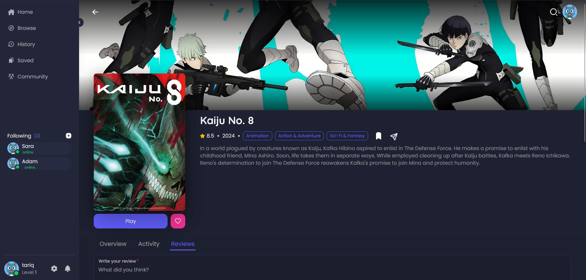

# FandomForge 🎬

A social trivia platform for movie and TV fans. Test your knowledge among your peers.



## Overview

Fandomforge is a web-based platform where users can:

- Discover and follow fellow fans
- Write reviews for movies and TV shows
- Complete in AI-generated trivia challenges
- Level up, earn XP, and climb the leaderboard to prove your knowledge

Built with a focus on community, gamification, and clean UI/UX, this app merges entertainment and social engagement into one seamless experience.

## Features checklist

Currently, this app is still in development. Here is a checklist of what needs to be done, and what is done so far.

- ✔️ - Complete
- ❌ - Still in progress
- ⚠️ - Partially complete

| Feature                      |                                           Description                                           | Progress |
| ---------------------------- | :---------------------------------------------------------------------------------------------: | -------: |
| User Profiles                |                Display profiles that contain the user's activity, followers, etc                |       ✔️ |
| Follow System                |                          Connect with others, build a network of fans                           |       ✔️ |
| User Reviews                 |                      Leave comments and rate your favourite content (1-10)                      |       ✔️ |
| Authentication               |                Registration and login through the email provider (via Supabase)                 |       ✔️ |
| Leveling & Leaderboard       |                     Gain XP for correct answers and rise through the ranks                      |       ❌ |
| Responsive & Accessible UI   |                              Tailored with TailwindCSS and HeroUI                               |       ✔️ |
| Real-Time Notifications      |               Get alerted when someone follows you or interacts with your content               |       ❌ |
| AI-Powered Trivia Generation | Random multiple-choice questions generated using GPT-4.1, based on selected movies or TV Series |       ❌ |
| Messaging System             |                            Directly message other fans in real-time                             |       ❌ |
| Search & Browse              |                  Discover trending, popular, and now-playing content from TMDB                  |       ✔️ |
| Pagination                   |                      Add pagination where necessary (movies, reviews, etc)                      |       ❌ |
| Edit Profile                 |                      Users can edit their avatar, display name, email, etc                      |       ❌ |
| Global Chat                  |           Users can interact in a global chat room so they can talk to the community            |       ❌ |
| User Status                  |                        Implement online and offline attributes to users                         |       ❌ |

## Tech Stack

- Frontend: Next.js, React, Tailwind CSS, HeroUI
- Backend: Supabase (PostgreSQL, Auth, Realtime), TMDB API
- AI: OpenAI (GPT-4.1) for generating trivia questions
- State Management: React Context + Tanstack Query
- Deployment: Vercel

## Getting Started

```bash
# Clone the repo
git clone https://github.com/txriq03/fandomforge
cd fandomforge

# Install dependencies
npm install

# Add your environmental variables (e.g. Supabase, OpenAI, TMDB keys)
cp .env.example .env.local

# Run the app
npm run dev
```

## Demo

You can check out the project at: [fandomforge.vercel.app](https://fandomforge.vercel.app)
